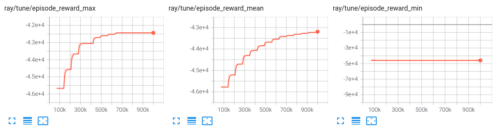

conda create -n rllib python=3.10
conda activate rllib
conda install ray-rllib=2.3.0
conda install gymnasium
conda install numpy=1.23.5
conda install pip
pip install energyplus
pip install tensorflow==2.9.0
pip install tensorflow-probability==0.14.1
(pip install torch==1.12.1)

restart terminal

Create new environmental variable PYTHONPATH with value C:\EnergyPlusV9-4-0 (this is the folder in my case)

make output folder in directory
python run.py --idf models/TT_03-26_Test.idf --epw weatherFiles/USA_MA_Boston-Logan.Intl.AP.725090_TMY3.epw --output outputs

if error about libiomp5md.dll, goto: 
C:\Users\Carbon\anaconda3\envs\rllib\Library\bin 
and remove libiomp5md.dll


# Ray RLlib - EnergyPlus Python API sample

An example of how to train a control policy using Ray RLlib and EnergyPlus Python API.

Requires EnergyPlus 9.3+

## Setup

### Package dependencies

Edit `requirements.txt` and add the deep learning framework of your choice (TensorFlow or PyTorch)

```shell
python3 -m venv env
source env/bin/activate
pip install -r requirements.txt
```

### Path dependencies

Add EnergyPlus folder to `PYTHONPATH` environment variable:

```shell
export PYTHONPATH="/usr/local/EnergyPlus-22-1-0/:$PYTHONPATH"
```

Make sure you can import EnergyPlus API by printing its version number

```shell
$ python3 -c 'from pyenergyplus.api import EnergyPlusAPI; print(EnergyPlusAPI.api_version())'
0.2
```

## Run example

```shell
python3 run.py \
  --idf /path/to/model.idf \
  --epw /path/to/LUX_LU_Luxembourg.AP.065900_TMYx.2004-2018.epw
```

Example of episode reward stats obtained training with PPO, 1e6 timesteps, 2 workers, untuned. Experiment took ~1h45min


